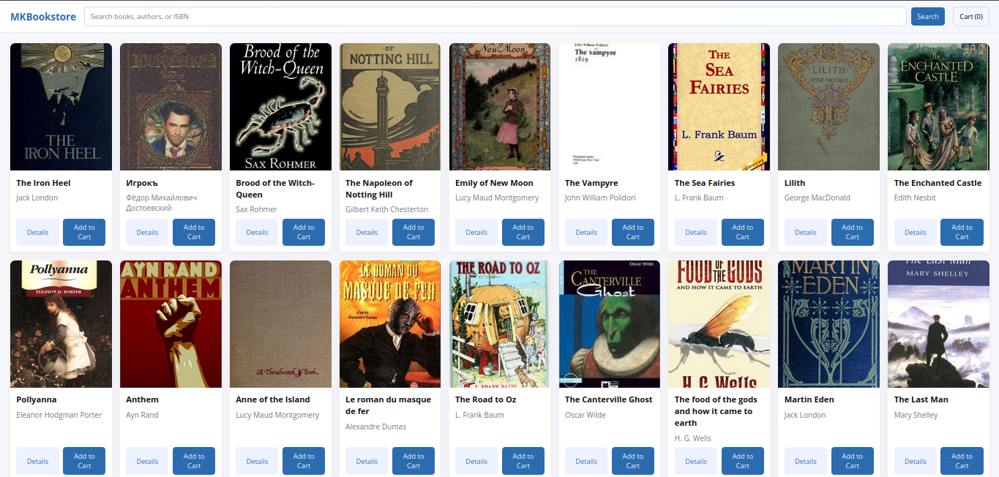
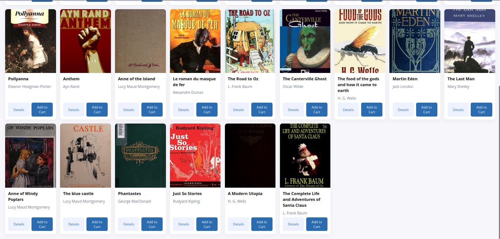
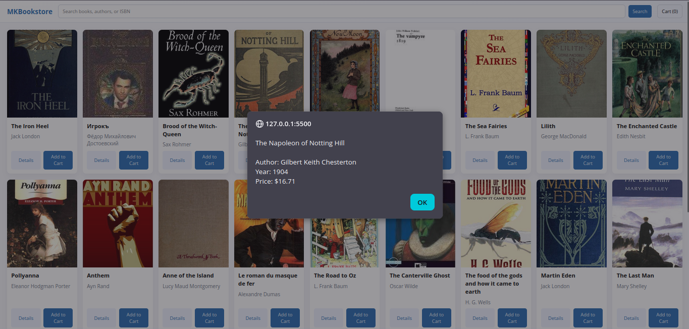
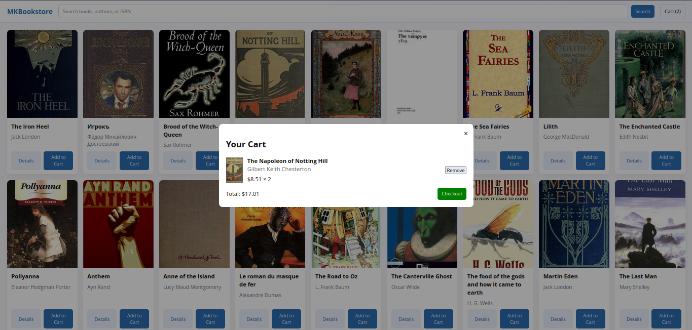

# MKBookstore — simple online bookstore demo

This small web app demonstrates a bookstore UI using HTML, CSS and JavaScript. It fetches fictional book data from the OpenLibrary API (fallback sample data included).

How to run locally:

1. Open a terminal in this folder.
2. Start a simple static server (Python 3):

```bash
python3 -m http.server 8000
```

3. Open http://localhost:8000 in your browser.

Features:

- Search books (uses OpenLibrary search API)
- Browse results with covers, title, author
- Add to cart, view cart, checkout (demo)
- Cart persisted in localStorage

Files:

- `index.html` — main page
- `styles.css` — styles
- `app.js` — fetch and UI logic

Screenshots:

- Home screen (example):

  

- Home part-2 screen (alternate):

  

- Details page:

  

- Shopping cart:

  
