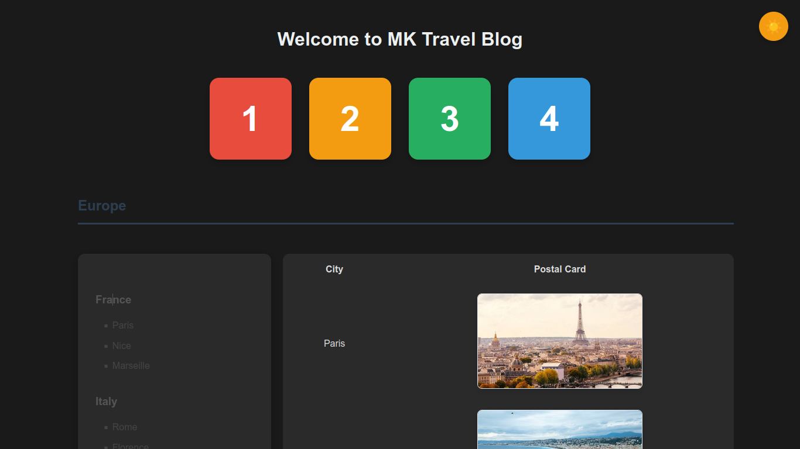

# 🌍 Travel Blog - Interactive Destination Explorer

A dynamic, interactive web application to explore travel destinations across the globe with an immersive image gallery experience.


## 📋 Table of Contents

- [Overview](#overview)
- [Features](#features)
- [Project Structure](#project-structure)
- [Technologies Used](#technologies-used)
- [Getting Started](#getting-started)
- [Directory Structure](#directory-structure)
- [Usage Guide](#usage-guide)
- [File Descriptions](#file-descriptions)

---

## 🎯 Overview

**Travel Blog** is a modern, single-page application that allows users to explore travel destinations across four continents (Europe, Asia, America, and Africa). Each continent contains multiple countries with their major cities, complete with interactive image galleries for each destination.

The application features:
- ✨ Dynamic content loading without page refresh
- 🖼️ Full-screen image viewer with navigation controls
- 🌙 Dark/Light mode toggle for comfortable viewing
- 📱 Responsive design for all devices
- ⚡ Fast performance with optimized data structure

---

## ✨ Features

### 1. **Interactive Continent Selection**
   - Click numbered blocks (1-4) to select continents
   - Dynamic content injection without page reload
   - Smooth scroll animation to the selected continent

### 2. **Dynamic Country & City Display**
   - Automatically displays countries and cities for selected continent
   - Click on any country to view its cities with postal card images
   - Organized in a clean, hierarchical structure

### 3. **Image Gallery & Viewer**
   - Thumbnail preview of city images
   - Full-screen modal viewer for detailed viewing
   - Navigation controls:
     - Previous/Next buttons
     - Arrow keys (← →) support
     - ESC key to close
   - Image counter showing current position (e.g., "3 / 10")
   - Fallback placeholder for missing images

### 4. **Theme Toggle**
   - Light/Dark mode switch button (fixed top-right corner)
   - Persistent preference saved in browser localStorage
   - Smooth transitions between themes
   - Icon changes: 🌙 (Light Mode) ↔ ☀️ (Dark Mode)

### 5. **Data-Driven Architecture**
   - All location data stored in a single JavaScript object
   - Easy to maintain and extend with new destinations
   - Efficient client-side rendering
   - No database required

---

## 📁 Project Structure

```
Assignment-Activity-Unit-2/
├── index.html          # Main HTML file
├── index.js            # JavaScript logic and data
├── styles.css          # CSS styling and themes
├── README.md          # This file
└── images/
    └── postal-cards/
        ├── europe/
        │   ├── france/
        │   │   ├── paris/
        │   │   ├── nice/
        │   │   └── lyon/
        │   ├── italy/
        │   │   ├── rome/
        │   │   ├── florence/
        │   │   └── venice/
        │   └── greece/
        │       ├── athens/
        │       ├── santorini/
        │       └── thessaloniki/
        ├── asia/
        │   ├── japan/
        │   ├── china/
        │   └── india/
        ├── america/
        │   ├── usa/
        │   ├── brazil/
        │   └── canada/
        └── africa/
            ├── south-africa/
            ├── egypt/
            └── morocco/
```

Each city directory should contain 10 images: `image1.png` through `image10.png`

---

## 🛠️ Technologies Used

| Technology | Purpose |
|-----------|---------|
| **HTML5** | Semantic markup & structure |
| **CSS3** | Styling, animations, dark mode theme |
| **JavaScript (ES6+)** | Dynamic content, event handling, theme management |
| **LocalStorage API** | Persisting user theme preference |
| **Flexbox & CSS Grid** | Responsive layout |

---

## 🚀 Getting Started

### Prerequisites
- Modern web browser (Chrome, Firefox, Safari, Edge)
- No dependencies or installations required

### Setup Instructions

1. **Clone or Download the Project**
   ```bash
   cd Assignment-Activity-Unit-2
   ```

2. **Open the Application**
   - Option A: Double-click `index.html` to open in default browser
   - Option B: Use a local server (recommended):
     ```bash
     # Using Python 3
     python -m http.server 8000
     
     # Using Python 2
     python -m SimpleHTTPServer 8000
     
     # Using Node.js (npx)
     npx http-server
     ```
   - Then visit `http://localhost:8000`

3. **Add Images (Required)**
   - Create the directory structure as shown above
   - Add 10 images per city folder: `image1.png` to `image10.png`
   - Images will be loaded on-demand in the gallery viewer

---

## 📖 Usage Guide

### Navigation

1. **Homepage View**
   - See 4 numbered blocks (1-4) representing continents
   - Europe = 1, Asia = 2, America = 3, Africa = 4

2. **Select a Continent**
   - Click any numbered block
   - Content dynamically loads showing countries and cities
   - Page scrolls to the new content

3. **View City Images**
   - Click on a country name (e.g., "France")
   - Table displays with cities and thumbnail images
   - Click any thumbnail to open the full-screen viewer

4. **Image Viewer Navigation**
   - **Previous/Next Buttons**: Navigate through images
   - **Arrow Keys**: ← → for quick navigation
   - **ESC Key**: Close the viewer and return
   - **Click Outside Image**: Also closes the viewer

5. **Toggle Theme**
   - Click the button in top-right corner (🌙/☀️)
   - Switch between light and dark modes
   - Preference is saved automatically

6. **Return to Home**
   - Click "↑ Back to Top" link
   - Clears the continent view
   - Returns to main navigation

---

## 📄 File Descriptions

### `index.html`
Main HTML file containing:
- Semantic structure
- Theme toggle button
- Continent selector blocks (1-4)
- Dynamic content container
- Image viewer modal
- Script references

**Key Sections:**
- `<button id="themeToggle">`: Theme switcher
- `<div id="contentContainer">`: Dynamically injected continent content
- `<div id="imageViewer">`: Full-screen image gallery modal

### `index.js`
JavaScript file with:
- **Data Structure**: `continentData` object containing all locations
  - 4 Continents
  - 12 Countries
  - 36 Cities total
  
- **Core Functions**:
  - `loadContinent(continentKey, event)`: Loads and displays continent
  - `generateContinentSection(continentKey)`: Creates HTML for continent
  - `attachCountryClickListeners()`: Adds interactivity to countries
  - `openImageViewer(imgElement)`: Opens full-screen gallery
  - `loadImage(imageNumber)`: Loads specific image
  - `toggleTheme()`: Switches between light/dark mode
  - `closeContinent()`: Returns to home view

- **Event Handlers**:
  - Keyboard support (Arrow keys, ESC)
  - Click outside modal to close
  - Auto-load saved theme on page load

### `styles.css`
Styling with:
- **Light Mode**: Clean, modern design
- **Dark Mode**: Eye-friendly dark theme (saved to localStorage)
- **Responsive**: Adapts to mobile, tablet, and desktop
- **Animations**: Smooth transitions and hover effects
- **Components**:
  - Theme toggle button styling
  - Continent selector blocks
  - Postal cards table
  - Image viewer modal
  - Navigation buttons

**Key Color Schemes**:
- Light: #f8f9fa (background), #333 (text)
- Dark: #1a1a1a (background), #e0e0e0 (text)

---

## 🎨 Customization Guide

### Adding New Destinations

Edit `index.js` in the `continentData` object:

```javascript
const continentData = {
  europe: {
    name: 'Europe',
    countries: {
      spain: {  // New country key
        name: 'Spain',
        cities: ['Madrid', 'Barcelona', 'Valencia']
      }
      // ... existing countries
    }
  }
  // ... other continents
};
```

Then create the image folder structure:
```
images/postal-cards/europe/spain/madrid/image1.png
images/postal-cards/europe/spain/madrid/image2.png
```

### Changing Color Schemes

Edit `styles.css`:
```css
/* Light mode */
body {
  background-color: #YOUR_COLOR;
  color: #YOUR_TEXT_COLOR;
}

/* Dark mode */
body.dark-mode {
  background-color: #YOUR_DARK_COLOR;
  color: #YOUR_DARK_TEXT_COLOR;
}
```

### Adjusting Image Gallery

Modify in `index.js`:
```javascript
// Change maximum images per city
nextBtn.disabled = imageNumber === 10;  // Change 10 to desired max
prevBtn.disabled = imageNumber === 1;
```

---

## 🔄 How It Works

### Page Load Flow
1. HTML loads with theme toggle button
2. JavaScript initializes with data structure
3. Theme preference loads from localStorage
4. User sees 4 continent selector blocks
5. Content container is empty, waiting for user action

### Continent Selection Flow
1. User clicks a number block
2. `loadContinent()` prevents default link behavior
3. `generateContinentSection()` creates HTML from data
4. HTML injects into `contentContainer`
5. `attachCountryClickListeners()` adds click handlers
6. Page scrolls to new content

### Country Selection Flow
1. User clicks on a country name
2. Event listener finds corresponding cities
3. Creates table with city names and image paths
4. Generates `` tags for thumbnails
5. Sets `onclick` handler for image viewer

### Image Viewer Flow
1. User clicks thumbnail image
2. `openImageViewer()` extracts city/country data
3. Modal becomes visible (`.active` class)
4. `loadImage()` sets image path and counter
5. Arrow keys and buttons navigate through images
6. ESC or click outside closes viewer

---

## 🌐 Browser Support

- Chrome 90+
- Firefox 88+
- Safari 14+
- Edge 90+
- Mobile browsers (iOS Safari, Chrome Mobile)

---

## 📝 Code Quality

- **No Dependencies**: Pure HTML, CSS, JavaScript
- **Responsive Design**: Works on all screen sizes
- **Accessible**: Semantic HTML, keyboard navigation
- **Performance**: Optimized for fast loading
- **Maintainable**: Clean code structure and comments

---

## 🔐 Notes

- All data is stored locally in JavaScript (no server calls)
- Theme preference saved in browser storage
- Images are stored locally in the `/images` folder
- No sensitive data or external API calls

---

## 📚 Learning Outcomes

This project demonstrates:
- ✅ DOM manipulation with vanilla JavaScript
- ✅ Event handling and delegation
- ✅ Data structures and object organization
- ✅ CSS styling and theming
- ✅ Local storage implementation
- ✅ Dynamic content rendering
- ✅ Responsive web design
- ✅ Modal/overlay components
- ✅ Keyboard event handling

---

## 📞 Support

For questions or issues:
1. Check this README
2. Review the inline code comments
3. Test in browser console for errors
4. Ensure image paths match the folder structure

---

## 📄 License

This project is part of CS 2205-01 Web Programming course.

---

## 🙏 Credits

**MK Travel Blog** - Interactive Destination Explorer
Created as a learning project for modern web development concepts.

---

**Last Updated**: February 10, 2026

---

### Quick Reference

| Action | How to Do It |
|--------|------------|
| Switch Continent | Click 1, 2, 3, or 4 |
| View City Images | Click country name |
| View Full Image | Click thumbnail |
| Navigate Images | Use ← → or arrow keys |
| Close Image Viewer | Press ESC or click outside |
| Toggle Theme | Click 🌙/☀️ button |
| Go Home | Click "↑ Back to Top" |

---

**Happy Exploring! 🌏✈️**
