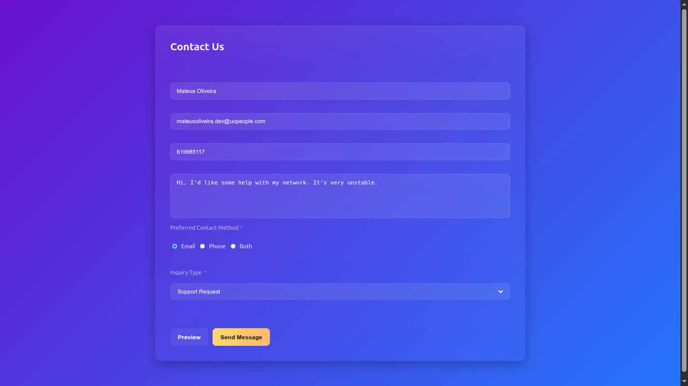
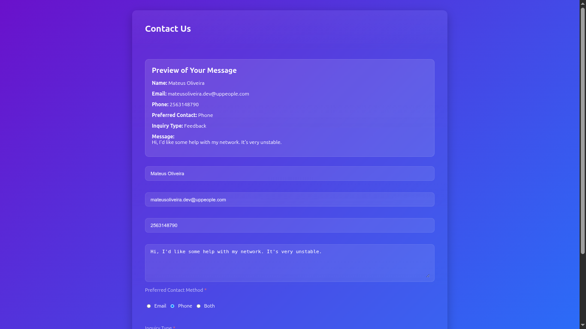
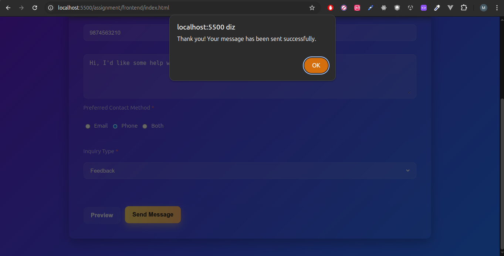

# Contact Form - Full-Stack Mini Project

A simple, modern and responsive contact form with client-side validation, live preview functionality and backend storage using Node.js, Express and SQLite.

## Features

- Beautiful glassmorphism design with gradient background
- Real-time form validation (required fields, email format, exactly 10-digit phone)
- Live preview of entered data (using GET parameters and URL history without page reload)
- Form submission via POST to Node.js backend
- Data stored persistently in SQLite database (`database.db`)
- Success and error feedback messages
- CORS enabled for local development
- Clean, professional UI

## Technologies Used

**Frontend**  
- HTML5  
- CSS3 (CSS variables, glassmorphism, flexbox, gradients)  
- Vanilla JavaScript (validation, fetch API, history.pushState)

**Backend**  
- Node.js  
- Express.js  
- SQLite3 (file-based database)  
- Multer (for parsing `multipart/form-data`)  
- CORS middleware

## Project Structure
```
assignment/
├── frontend/
│   └── index.html              # The 
│   └── index.js
│   └── style.css
├── backend/
│   ├── server.js               # Express 
│   └── database.db
│   └── package.json
│   └── package-lock.json
│   └── .gitignore
server + SQLite logic
│   ├── package.json
│   └── database.db             # SQLite database (auto-created)
└── README.md
```

## Installation & Setup

### Prerequisites

- Node.js (v16 or higher recommended)
- npm

### Backend Setup

1. Navigate to the backend folder:

   ```bash
   cd backend
   ```

Install dependencies:
    
```bash
    npm install
```
Start the server:

```bash
    node server.js
```

Server will be available at:

http://localhost:3000

Available endpoints:

- POST /contact → submit contact form data
- GET /contacts → retrieve all saved messages (JSON)


Frontend Setup

Open frontend/index.html in your browser

Recommended: use VS Code Live Server extension (usually opens on http://localhost:5500)

Make sure the fetch URL in JavaScript matches your backend:JavaScriptconst SERVER_URL = 'http://localhost:3000/contact';

Screenshots
1. Empty Form
Empty Contact Form
Clean form with gradient background and glassmorphism input fields



2. Live Preview
Live Preview Feature
Preview card appears above the form after clicking "Preview"



3. Success Message
Success Message After Submission
Form resets and success alert is shown after successful submission



4. Saved Messages (GET /contacts)
Saved Contacts in Database
JSON response showing all stored contact entries
Note: Add real screenshots to a screenshots/ folder and update the image paths in this README.
How to Test


Start the backend server

Open the HTML file in browser

Fill in the form → click Preview → see live preview
Fix any validation errors → click Send Message
Check browser alert → form should reset

Visit http://localhost:3000/contacts in browser or Postman to see saved data

Future Improvements

Add email notification on new submissions (Nodemailer)
Simple admin page to view/delete messages
CAPTCHA protection against spam
Deploy backend (Render, Railway, Vercel) and frontend (Netlify, Vercel)
Add file upload support (e.g. attachment)

License
MIT License
Feel free to use, modify and share.
Made with :fire: by Mateus
February 2026
textYou can copy this entire content and paste it into your `README.md` file.

Just remember to:
- Create a `screenshots/` folder in the root of your repository
- Take and save the 5 screenshots with the suggested names
- Commit everything

If you want to add badges (stars, license, etc.), more sections or change anything, just tell me!