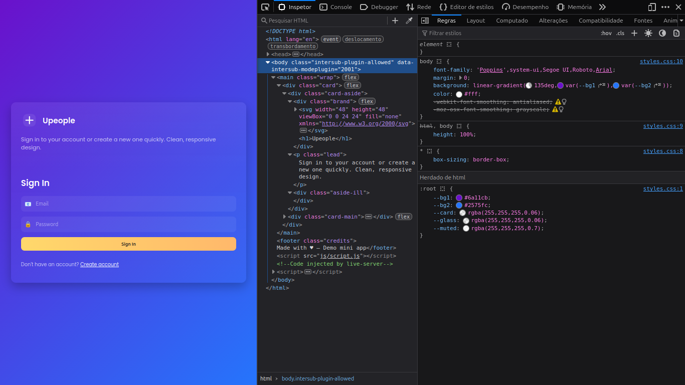
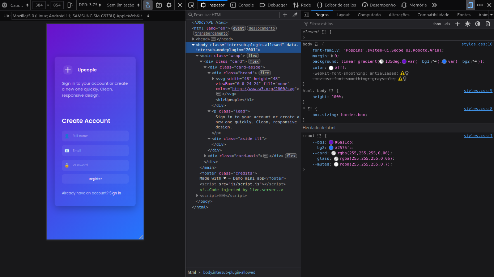

# Mini App — Login / Register

Small front-end prototype with login and registration (HTML/CSS/JS only). Responsive design with simple icons.

How to use
- Open the `index.html` file in your browser.
- The forms are example-only — submissions are simulated using `alert()`.

Structure
- `index.html` — main page
- `css/styles.css` — responsive styles
- `js/script.js` — toggles forms and handles simulated submissions

Would you like me to add stronger validation, integrate with a backend (e.g. Firebase), or convert this into a Node/Express project? Tell me which option you prefer.

## Screenshots

The `screenshot/` folder contains the UI captures used in this project:

- **Desktop (main)** — `screenshot/image1.png`

	

- **Tablet** — `screenshot/image2.png`

	

- **Smartphone (portrait)** — `screenshot/image3.png`

	

- **Smartphone (alternate / small)** — `screenshot/image4.png`

	

Place your images in the `screenshot/` folder with the exact filenames above so they render correctly in the README.
