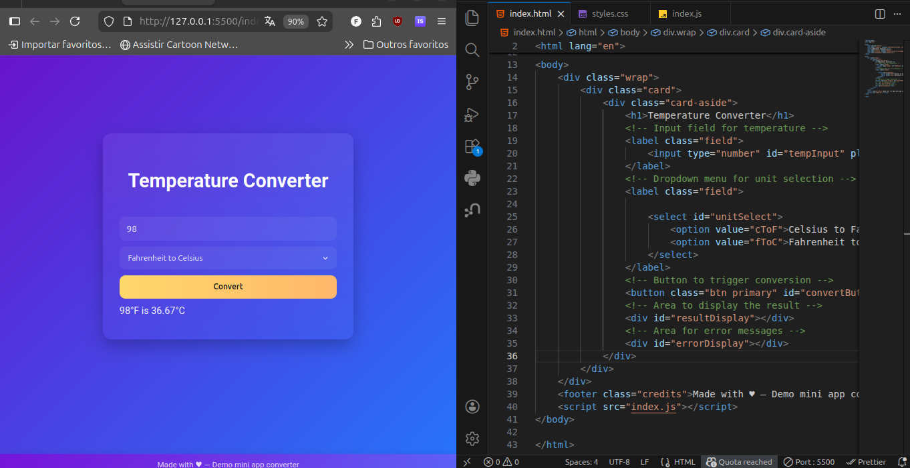

# Temperature Converter

A simple, responsive web-based temperature converter that allows users to convert values between **Celsius (°C)** and **Fahrenheit (°F)**.

## Features

- Convert from Celsius to Fahrenheit and vice versa
- Real-time conversion on button click
- Input validation (only numeric values accepted)
- Clear error messages for invalid input
- Clean and modern interface with a blue "Convert" button
- Fully responsive for desktop and mobile

## Technologies Used

- **HTML5** – Structure and semantics
- **CSS3** – Styling and layout
- **JavaScript (ES6+)** – Logic, event handling, and calculations

## How to Use

1. Open `temperature_converter.html` in any modern web browser
2. Enter a numeric temperature value
3. Select the conversion direction:
   - Celsius to Fahrenheit
   - Fahrenheit to Celsius
4. Click the **Convert** button
5. View the result or any error message below the button

## Conversion Formulas

- **Celsius to Fahrenheit**:  
  °F = (°C × 9/5) + 32

- **Fahrenheit to Celsius**:  
  °C = (°F − 32) × 5/9

## Project Structure
```
📁 assignment
 ├── 📁 image
 ├── 📄index.html
 ├── 🎨 style.css
 ├── ⚙️ script.js
 └── README.md
```
## Screenshots

Example 1: Initial interface.


Example 2: Conversion of 36°C to Fahrenheit (result ≈ 96.80°F).


Example 3: Conversion of 98°F to Celsius (result ≈ 36.67°F).



Example 4: Error message for non-numeric input.


**Example:**
- Input: 36 °C → Output: 96.80 °F
- Input: abc → Output: "Invalid input: please enter a number."

## Author

- **MKawan**  
  Created as a learning project (February 2026)

## License

MIT License – feel free to use, modify, and share.
