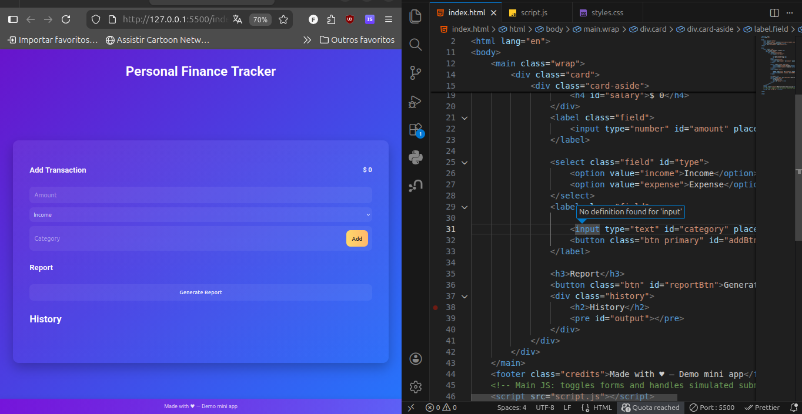
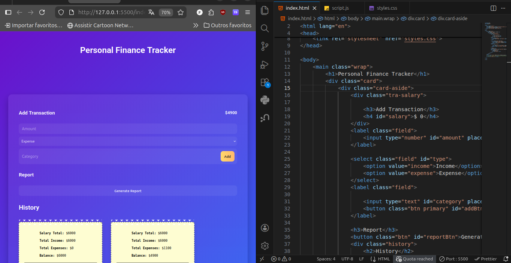
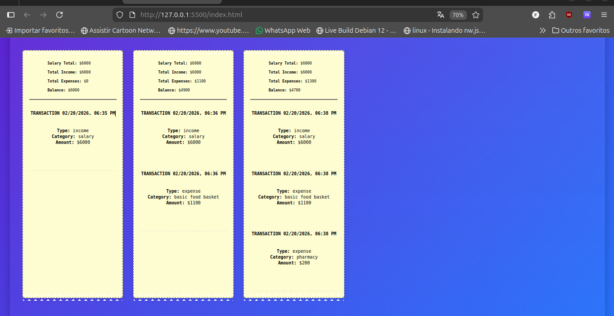
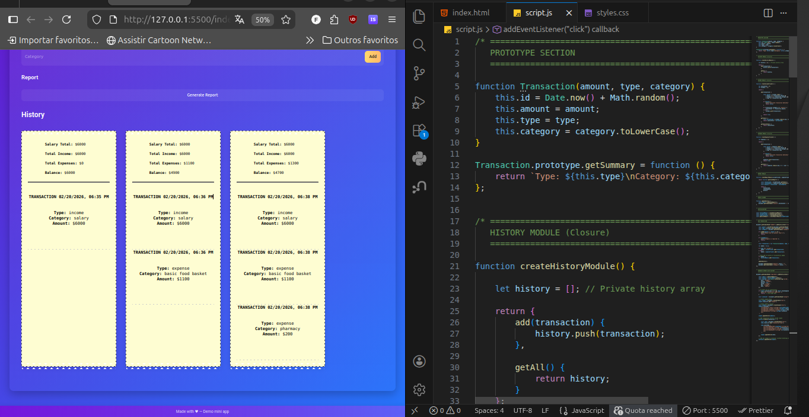
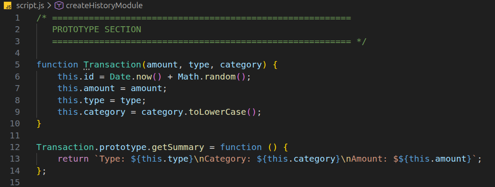
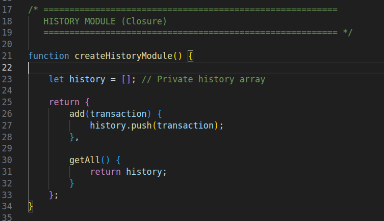
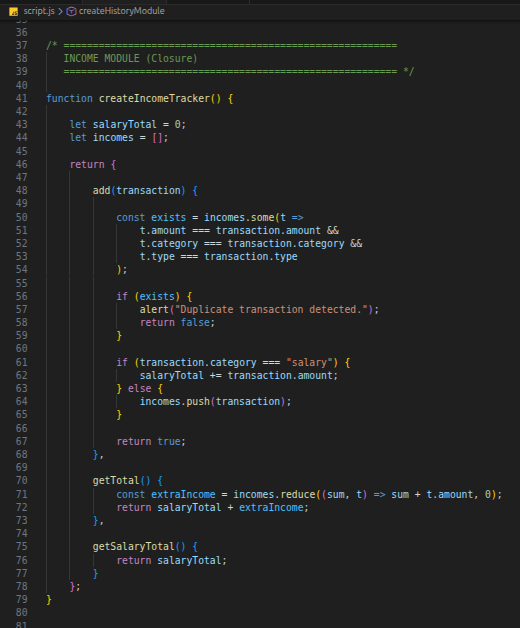

# 💰 Personal Finance Tracker

A modern Personal Finance Tracker built with **HTML, CSS, and Vanilla JavaScript**, designed to demonstrate advanced JavaScript concepts such as:

- ✅ Closures
- ✅ Prototypes
- ✅ Modular Architecture
- ✅ Dynamic DOM Manipulation
- ✅ Encapsulation
- ✅ Performance Optimization

---

## 📌 Project Overview

This application allows users to:

- Add income and expense transactions
- Categorize transactions (e.g., salary, food, freelance)
- Automatically accumulate salary when category = "salary"
- Prevent duplicate transactions
- Generate financial reports
- Display transaction history as dynamic coupon-style receipts
- Scroll through transaction history

#### Screenshort of a project









---

## 🧠 JavaScript Concepts Demonstrated

### 🔒 Closures

Closures are used to:

- Keep `salaryTotal`, `incomes`, and `expenses` private
- Maintain a private transaction history
- Prevent direct external access to internal state
- Create modular and maintainable components

Modules implemented with closures:

- `createIncomeTracker()`
- `createExpenseTracker()`
- `createHistoryModule()`
- `createReportModule()`

This ensures encapsulation and separation of concerns.

---

### ⚡ Prototypes

The `Transaction` constructor uses prototypes:

```javascript
Transaction.prototype.getSummary = function () {
    return ...
};
```
Why?

- Shared methods are stored once in memory

- Improves performance with large datasets

- Prevents method duplication per instance

This is especially important when handling many transactions.

### 🎨 UI Features

- Modern gradient background

- Glassmorphism layout

- Animated coupon-style transaction blocks

- Perforated coupon edges (receipt effect)

- Horizontal/vertical scroll support

- Responsive design

### 🧾 Coupon Effect

Transactions are displayed as receipt-style coupons using:

- ::before and ::after

- radial-gradient

- position: absolute

- CSS animations

Each generated report creates a new visual coupon block.

### 🏗️ Project Structure

```
📁 project
 ├── index.html
 ├── style.css
 ├── script.js
 └── README.md
```

### 🚀 How It Works
#### 1️⃣ Add Transaction

- Enter amount

- Select type (income or expense)

- Enter category

- Click Add

If category is "salary":

- It accumulates into salaryTotal

2️⃣ Generate Report

Click Generate Report to:

- Calculate totals

- Compute balance

- Create a new coupon block

- Append transaction history visually

No text overwriting — dynamic DOM creation is used instead.

### 📊 Example Output

```
    Salary Total: $5300
    Total Income: $5300
    Total Expenses: $1200
    Balance: $4100
```
Displayed as a styled receipt block in the interface.

### 🛡️ Validations Implemented

- Prevent zero or negative values

- Prevent duplicate transactions

- Prevent empty category

- Controlled salary accumulation

### 📱 Responsive Design

Works on desktop

Adapts to tablets

Stacks layout on mobile devices

### 🎯 Learning Objectives Achieved

✔ Modular JavaScript structure
✔ Data encapsulation using closures
✔ Memory-efficient design using prototypes
✔ Clean separation between logic and UI
✔ Dynamic DOM manipulation
✔ CSS advanced styling techniques

### 🔮 Possible Improvements

- Edit/delete transactions

- Persist data with LocalStorage

- Export report as PDF

- Add charts (Chart.js)

- Add dark/light theme toggle

### 📚 Author

Developed as part of an academic assignment exploring advanced JavaScript concepts.

### 🏁 Final Result

This project demonstrates how modern JavaScript architecture principles can be applied even in small applications to improve:

- Maintainability

- Scalability

- Performance

- Code organization


