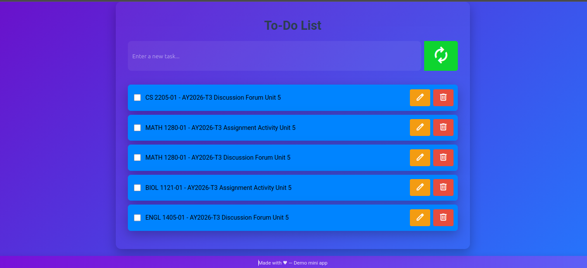
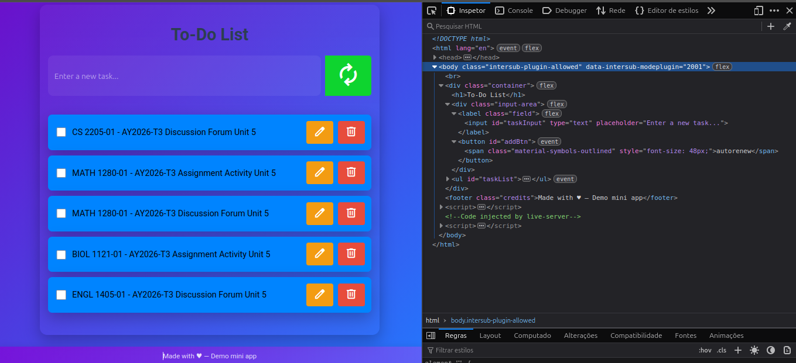
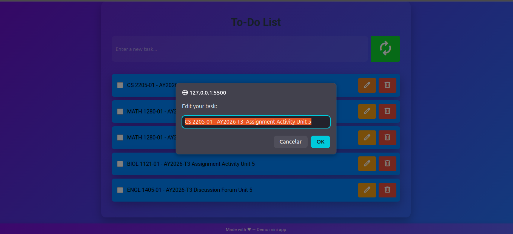

# To-Do List App

A simple to-do list application developed with HTML, CSS, and pure JavaScript, using **event delegation** to efficiently manage dynamic interactions.



## Features

- Add new tasks through a text field and button
- Mark tasks as completed / incomplete (with checkbox and visual strikethrough)
- Edit existing tasks (opens a custom modal with OK/Cancel)
- Remove tasks from the list
- Responsive interface with modern glassmorphism effect

## Technologies Used

- HTML5 (semantic structure)
- CSS3 (flexbox, grid, media queries, glassmorphism, gradients)
- JavaScript (DOM manipulation, event delegation, click and change events)
- Google Fonts (Roboto)
- Material Symbols (Google icons)

## How to Use

1. Clone the repository or download the files:

```
git clone <link here>
```


2. Open the `index.html` file in any modern browser.

Or simply drag the `index.html` file into a browser tab.

## Project Structure

```
assignment/
├── 📁 img
├── 📄 indexfull.html # Full code Main page structure
├── 📄 index.html # Main page structure
├── 🎨 styles.css # Styles (glassmorphism + responsiveness)
├── ⚙️ script.js # Application logic (event delegation modal)
└── README.md # This file
```


## Screenshots

  
*(Task list with some completed items)*

  
*(Edit dialog with OK and Cancel)*

## Notes

- This project was created as part of an academic exercise to demonstrate the proper use of **event delegation**.
- It does not use external frameworks or libraries (only Google fonts and icons).
- Fully responsive (works well on desktop and mobile).

## Author

**Mateus**  
Student at Computer Science  
University of the People (UoPeople)  
2026

Made with ♥ — For educational purposes.