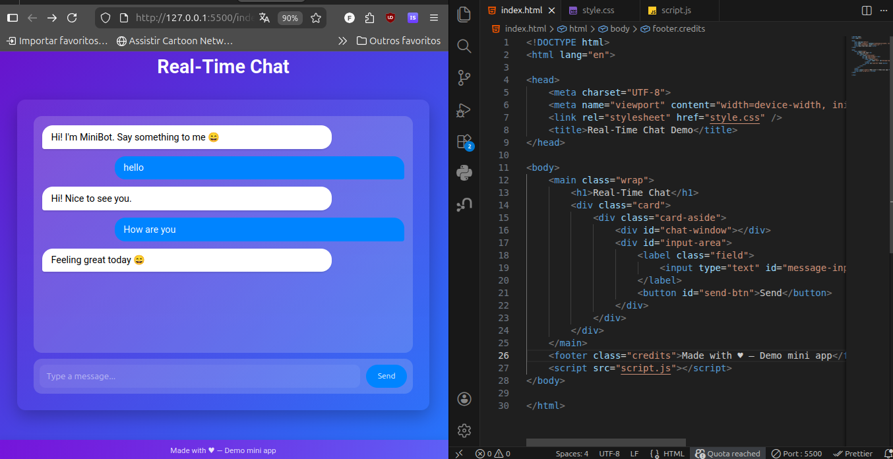
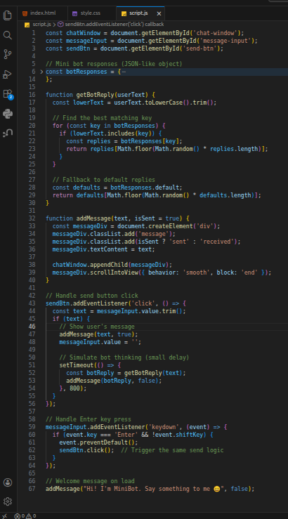

# Mini Chat Demo with JavaScript DOM Manipulation

A simple real-time chat interface featuring a friendly mini bot (MiniBot) that responds based on keyword matching. Built to demonstrate **DOM manipulation**, **event handling**, and interactive web development using pure HTML, CSS, and JavaScript.

 
*Figure 1. Running chat application showing welcome message, user input "hello", and bot response "Hi! Nice to see you."*

## Features

- Dynamic message appending using `appendChild`
- Automatic smooth scrolling to the latest message with `scrollIntoView`
- User message input via text field + Send button or **Enter** key
- Mini bot with predefined JSON-based responses (random selection for variety)
- Responsive, clean UI with different styling for sent/received messages
- Simulated bot reply delay for realism

## Technologies Used

- **HTML5** – Semantic structure and chat layout
- **CSS3** – Modern styling, flexbox, rounded bubbles, shadows
- **JavaScript (Vanilla)** – DOM manipulation, event listeners (`addEventListener`, `click`, `keydown`), JSON object for bot logic

No external frameworks or libraries required.

## Installation & Setup

1. Clone or download the project files:

index.html
style.css      (or inline styles)
script.js


2. Open `index.html` in any modern browser (Chrome, Firefox, Edge, etc.).

No server or build tools needed – it runs locally!

## Usage

1. Type a message in the input field (e.g., "hi", "how are you", "bye", "thanks", or anything else).
2. Press **Enter** or click **Send**.
3. MiniBot will reply after a short delay based on keyword matching.
4. If no match is found, it falls back to a random default response.

### Example Conversation

- Bot: Hi! I'm MiniBot. Say something to me 😄
- You: hello
- Bot: Hi! Nice to see you.
- You: How are you
- Bot: Feeling great today 😄

  
*Figure 2. Screenshot of the main HTML markup, including chat window, input area, and script tag.*


*Figure 3. Core JavaScript logic showing `addMessage`, event listeners, and `botResponses` object.*

## Project Structure

```
disc/
 ├── 📁 img/
 ├── 📄index.html    # Main page with structure
 ├── 🎨 style.css    # (Optional) External styles
 └── ⚙️ script.js    # All JavaScript logic           
```


## How It Works (Key Concepts)

- **DOM Updates**: Creates `<div>` elements for messages → `appendChild` to add them → `scrollIntoView` for auto-scroll.
- **User Events**: `addEventListener` for `click` on send button and `keydown` (Enter) on input.
- **Bot Intelligence**: Simple keyword search in user text → random reply from JSON object.

Great for learning front-end interactivity!

## Future Improvements

- Add timestamps to messages
- Support user avatars
- Integrate WebSockets for real multi-user chat
- Improve bot with more advanced matching or AI API

Made with ♥ by Mateus – February 2026

Happy coding!